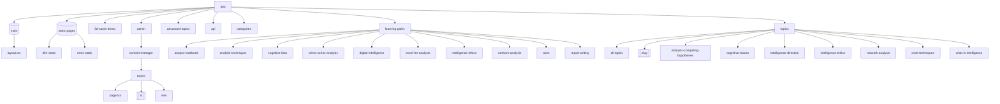

# Next.js Application Page Tree Structure

```mermaid
graph TD
    A[app] --> B[(main)]
    A --> C[(static-pages)]
    A --> D[3d-cards-demo]
    A --> E[admin]
    A --> F[advanced-topics]
    A --> G[api]
    A --> H[categories]
    A --> I[learning-paths]
    A --> J[topics]
    
    B --> B1[layout.tsx]
    
    C --> C1[404-static]
    C --> C2[error-static]
    
    E --> E1[content-manager]
    E1 --> E1a[topics]
    E1a --> E1a1[page.tsx]
    E1a --> E1a2[[id]]
    E1a --> E1a3[new]
    
    I --> I1[analyst-notebook]
    I --> I2[analytic-techniques]
    I --> I3[cognitive-bias]
    I --> I4[crime-series-analysis]
    I --> I5[digital-intelligence]
    I --> I6[excel-for-analysts]
    I --> I7[intelligence-ethics]
    I --> I8[network-analysis]
    I --> I9[osint]
    I --> I10[report-writing]
    
    J --> J1[all-topics]
    J --> J2[[slug]]
    J --> J3[analysis-competing-hypotheses]
    J --> J4[cognitive-biases]
    J --> J5[intelligence-direction]
    J --> J6[intelligence-ethics]
    J --> J7[network-analysis]
    J --> J8[osint-techniques]
    J --> J9[what-is-intelligence]
```

Key:
- `()` = Route group
- `[]` = Regular page
- `[[]]` = Dynamic segment
- `layout.tsx` = Layout file